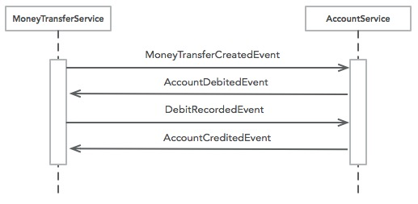

# ROSE 例子：MoneyTransfer - 转账服务

通过领域事件驱动一笔转账流程的完成。

## 1. /transfer/create 创建一笔转账

## 2. 转账涉及的事件

* MoneyTransferCreatedEvent
* AccountDebitedEvent
* MoneyTransferDebitRecordedEvent
* AccountCreditedEvent
* MoneyTransferCompletedEvent

## 3. 涉及的两个实体及转账流程

### MoneyTransfer跟踪一笔转账的状态，Account代表账户及其操作

### 序列图：

### 状态图：

